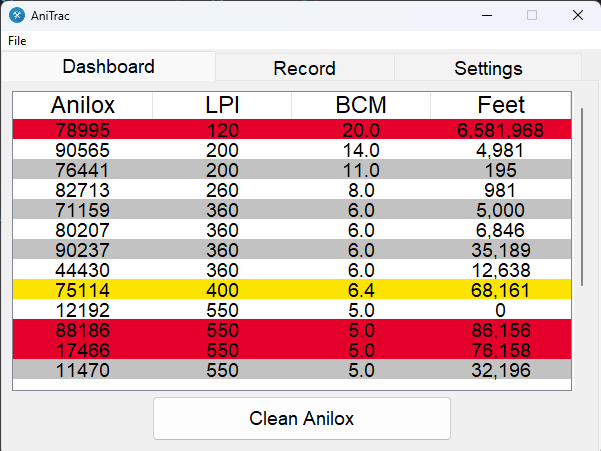
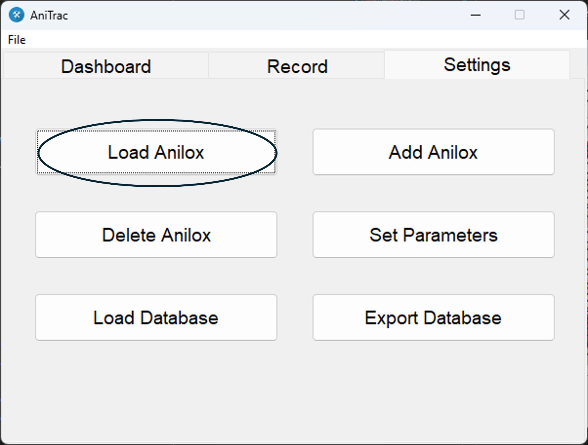
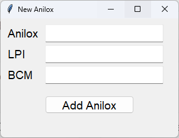
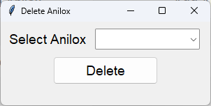
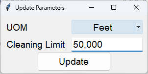
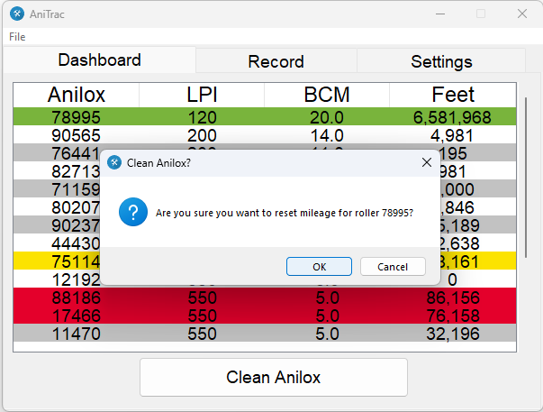
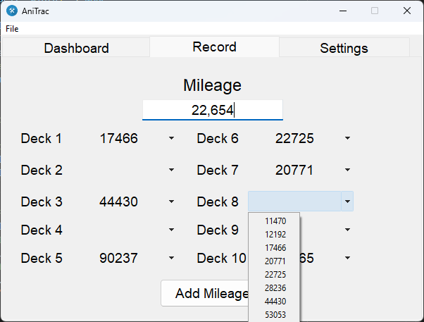

<!-- Improved compatibility of back to top link: See: https://github.com/othneildrew/Best-README-Template/pull/73 -->

<!-- PROJECT SHIELDS -->

[![Contributors][contributors-shield]][contributors-url]
[![Forks][forks-shield]][forks-url]
[![Stargazers][stars-shield]][stars-url]
[![Issues][issues-shield]][issues-url]
[![MIT License][license-shield]][license-url]
[![LinkedIn][linkedin-shield]][linkedin-url]

<!-- PROJECT LOGO -->
 

  

<h3 align="center">Anitrac</h3>

  

    Light-weight flexographic anilox mileage tracker.
     
    <a href="https://github.com/msrogers2015/anitrac"><strong>Explore the docs »</strong></a>
     
     
    <a href="https://github.com/msrogers2015/anitrac">View Demo</a>
    ·
    <a href="https://github.com/msrogers2015/anitrac/issues">Report Bug</a>
    ·
    <a href="https://github.com/msrogers2015/anitrac/issues">Request Feature</a>
  

<!-- TABLE OF CONTENTS -->

  
Table of Contents

  <ol>
    <li>
      <a href="#about-the-project">About The Project</a>
      <ul>
        <li><a href="#built-with">Built With</a></li>
      </ul>
    </li>
    <li>
      <a href="#getting-started">Getting Started</a>
      <ul>
        <li><a href="#prerequisites">Prerequisites</a></li>
        <li><a href="#installation">Installation</a></li>
      </ul>
    </li>
    <li><a href="#usage">Usage</a></li>
    <li><a href="#roadmap">Roadmap</a></li>
    <li><a href="#contributing">Contributing</a></li>
    <li><a href="#license">License</a></li>
    <li><a href="#contact">Contact</a></li>
  </ol>

<!-- ABOUT THE PROJECT -->
## About The Project

(<a href="#readme-top">back to top</a>)

### Built With

* [![Python][Python]][Python-url]
* [![SQLite][SQLite]][SQLite-url]

(<a href="#readme-top">back to top</a>)

<!-- GETTING STARTED -->
## Getting Started

The installer can be used like any other installer, via double clicking it and following the 
steps provided by the installer. Otherwise, follow the instructions in the Prerequisites section.

### Prerequisites

If you have downloaded the source code, use `pip install -r requirements.txt` to install required
packages then run the main.py file.

(<a href="#readme-top">back to top</a>)

<!-- USAGE EXAMPLES -->
## Usage

When opening the application for the first time, anilox information will need to be loaded into the
database. This can be done by first navigating to the `Setttings` tab. From here, select `Load Anilox`. This requires a csv file in the format of roller id, lines per inch (LPI) and billions of cubic microns (BCM). An example file would look like:

    516847, 550, 5.0
    681381, 900, 2.8
    398168, 200, 11.0

Other options in the settings window include:
 - Add Anilox: A new single anilox can be added to the database with zero mileage.
 
 
 
 - Delete Anilox: You can remove an anilox from the database

 

 -Set Parameters: The configerations (unit of measure and mileage limit) can be changed here

  

- Load Database: Repopulate database, including mileage, from exported csv file. 

- Export Database: Export all information in database, including mileage, into a csv file.

&nbsp;

&nbsp;

From the Dashboard, you can clear mileage from a selected anilox roller. The selected anilox
roller will be hi-lighted green. A confirmation dialog box will appear after pressing the
Clean Anilox button. If no roller is select, a warning message will appear when clicking the button.

&nbsp;

&nbsp;

&nbsp;

The Record tab allows you to record mileage for up to 10 anilox rollers at a time. 
First, input the mileage into the Mileage entry box. Next, select the rollers from the drop down menus for each unit. Finally, click the Add Mileage button to update mileage for selected anilox rollers. 

&nbsp;

(<a href="#readme-top">back to top</a>)

<!-- ROADMAP -->
## Roadmap
Currently, there are no further updates planned. If you would like to suggest changes or features,
see the [open issues](https://github.com/msrogers2015/anitrac/issues) to make the request. This can
also be used to report any bugs.

(<a href="#readme-top">back to top</a>)

<!-- CONTRIBUTING -->
## Contributing

Contributions are what make the open source community such an amazing place to learn, inspire, and create. Any contributions you make are **greatly appreciated**.

If you have a suggestion that would make this better, please fork the repo and create a pull request. You can also simply open an issue with the tag "enhancement".
Don't forget to give the project a star! Thanks again!

1. Fork the Project
2. Create your Feature Branch (`git checkout -b feature/AmazingFeature`)
3. Commit your Changes (`git commit -m 'Add some AmazingFeature'`)
4. Push to the Branch (`git push origin feature/AmazingFeature`)
5. Open a Pull Request

(<a href="#readme-top">back to top</a>)

<!-- LICENSE -->
## License

Distributed under the GNU Affero General Public License v3.0. See `LICENSE.txt` for more information.

(<a href="#readme-top">back to top</a>)

<!-- CONTACT -->
## Contact

rogersmar2015@gmail.com

Project Link: [https://github.com/msrogers2015/anitrac](https://github.com/msrogers2015/anitrac)

(<a href="#readme-top">back to top</a>)

<!-- MARKDOWN LINKS & IMAGES -->
<!-- https://www.markdownguide.org/basic-syntax/#reference-style-links -->
[contributors-shield]: https://img.shields.io/github/contributors/msrogers2015/anitrac.svg?style=for-the-badge
[contributors-url]: https://github.com/msrogers2015/anitrac/graphs/contributors
[forks-shield]: https://img.shields.io/github/forks/msrogers2015/anitrac.svg?style=for-the-badge
[forks-url]: https://github.com/msrogers2015/anitrac/network/members
[stars-shield]: https://img.shields.io/github/stars/msrogers2015/anitrac.svg?style=for-the-badge
[stars-url]: https://github.com/msrogers2015/anitrac/stargazers
[issues-shield]: https://img.shields.io/github/issues/msrogers2015/anitrac.svg?style=for-the-badge
[issues-url]: https://github.com/msrogers2015/anitrac/issues
[license-shield]: https://img.shields.io/github/license/msrogers2015/anitrac.svg?style=for-the-badge
[license-url]: https://github.com/msrogers2015/anitrac/blob/master/LICENSE.txt
[linkedin-shield]: https://img.shields.io/badge/-LinkedIn-black.svg?style=for-the-badge&logo=linkedin&colorB=555
[linkedin-url]: https://linkedin.com/in/marquel-rogers
[Python]: https://img.shields.io/badge/python-000000?style=for-the-badge&logo=python
[Python-url]: https://www.python.org/
[SQLite]: https://img.shields.io/badge/sqlite3-000000?style=for-the-badge&logo=sqlite
[SQLite-url]: https://www.sqlite.org/index.html